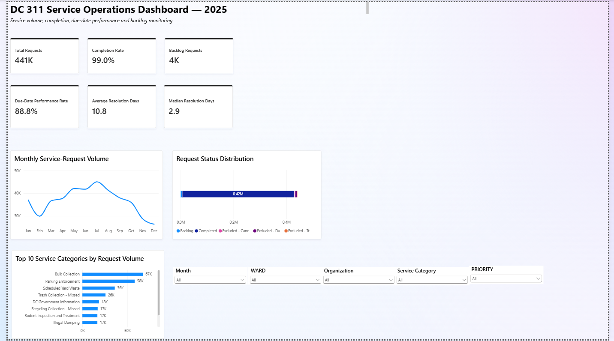
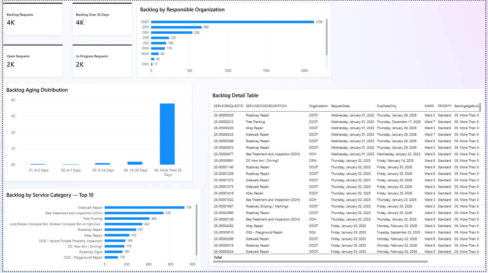

# DC 311 Operations Dashboard

## Project Overview

This project analyzes 2025 DC 311 service-request data using Microsoft Power BI. The dashboard provides insights into service volume, completion performance, due-date performance, resolution time, backlog, and data quality.

The project demonstrates how business analytics can transform operational data into meaningful insights that support data-driven decision-making.

## Business Objective

The objective of this project is to analyze DC 311 service operations and identify patterns in request volume, service performance, resolution time, and backlog. The dashboard provides a clear view of operational performance and highlights areas that may require management attention.

## Dashboard Pages

- Executive Overview
- Service Performance
- Backlog Analysis
- Data Quality
- Key Business Findings

## Key Performance Indicators

The dashboard includes several operational KPIs, including:

- Total Requests
- Completion Rate
- Backlog Requests
- Due-Date Performance Rate
- Average Resolution Days
- Median Resolution Days
- Open Requests
- In-Progress Requests

## Tools and Skills

- Microsoft Power BI
- Power Query
- DAX
- Data Cleaning
- Data Modeling
- KPI Development
- Data Visualization
- Business Analytics
- GitHub

## Dashboard Preview

### Executive Overview

### Service Performance

### Backlog Analysis

### Data Quality

### Key Business Findings

## Project Structure

- `dashboard/` — Contains the Power BI dashboard file.
- `documentation/` — Contains project methodology, KPI definitions, data-cleaning steps, and findings.
- `screenshots/` — Contains screenshots of the completed Power BI dashboard pages.

## Documentation

Additional project documentation includes:

- `KPI_Definitions.md` — Definitions and explanations of the major KPIs.
- `Data_Cleaning_Steps.md` — Data preparation and cleaning procedures.
- `Methodology.md` — Analytical approach and dashboard-development methodology.
- `Findings.md` — Key findings and business insights from the analysis.

## Project Outcome

The dashboard provides an operational view of DC 311 service requests by combining service-volume, completion, due-date, resolution-time, and backlog metrics. It demonstrates the use of Power BI, Power Query, DAX, data modeling, and visualization to support operational analysis and business decision-making.

## Power BI File

The complete Power BI `.pbix` file is available in the `dashboard` folder.
